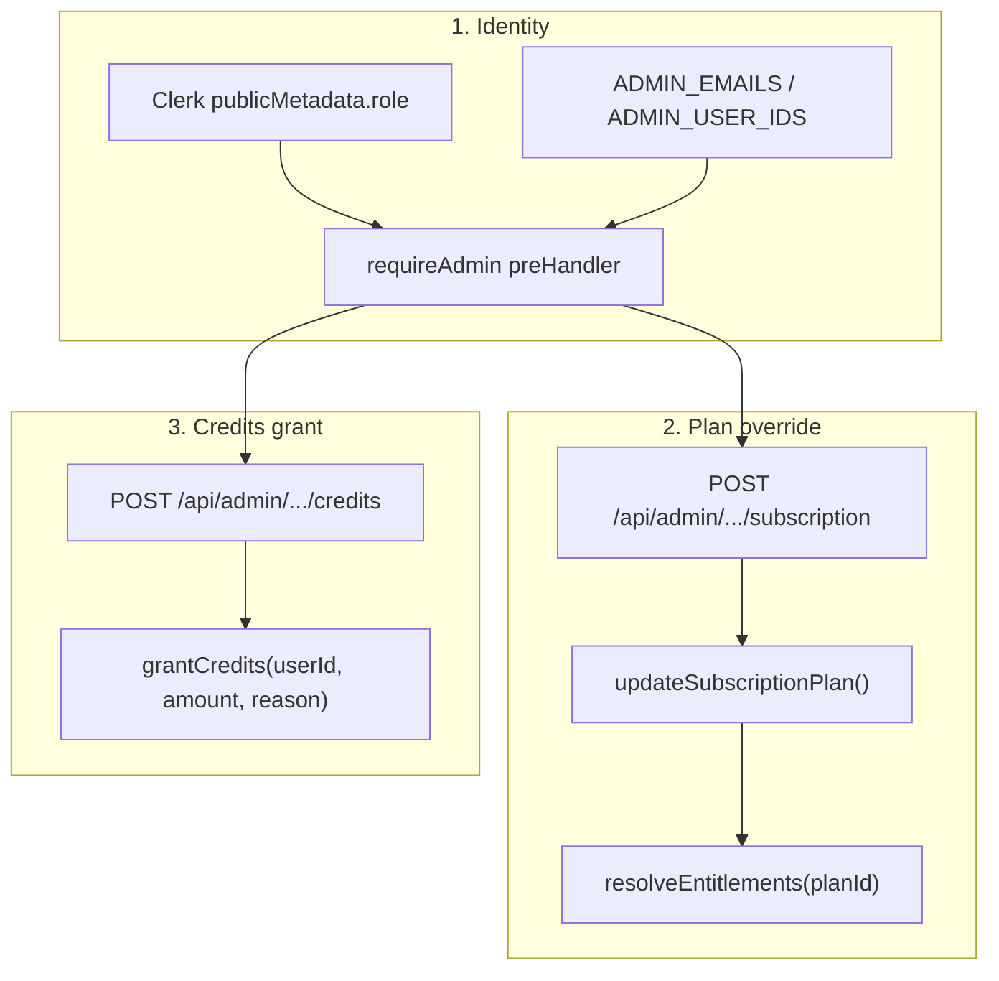

# Admin и QA: dev/testing flow

Документ описывает **целевой процесс** для разработки и тестирования тарифов,
credits и entitlements. Реализация — поэтапная (см. [План внедрения](#план-внедрения)).

## Цель

| Роль | Задача |
| ---- | ------ |
| **Admin** (например Demon SDA) | Полный доступ: переключение тарифов, выдача credits, просмотр состояния пользователей |
| **QA / тестировщики** | Отдельные аккаунты с назначенным plan и/или credits для прогона фич |
| **Разработка** | Без Stripe и ручного SQL на каждый тест |

## Текущее состояние (as-is)

```txt
Auth          Clerk (+ опционально AUTH_DEV_MODE)
Тариф         Subscription.planId  →  resolveEntitlements(planId)
Credits       append-only ledger   →  grantCredits / spendCredits / refundCredits
Смена plan    Только Stripe checkout + webhook (updateSubscriptionPlan)
Admin         Нет ролей, нет admin API/UI, нет audit log
Новый user    syncAuthUser: plan free + FREE_DEMO_CREDITS (50) один раз
Free top-up   ensureFreeTierCredits: до 30 credits для старых free-пользователей
```

Ключевые файлы:

| Область | Путь |
| ------- | ---- |
| Sync user + demo credits | `apps/api/src/modules/auth/sync-auth-user.ts` |
| Subscription CRUD | `apps/api/src/modules/billing/subscription.service.ts` |
| Entitlements | `apps/api/src/modules/billing/entitlements.service.ts` |
| Free credits upgrade | `apps/api/src/modules/billing/free-tier-credits.service.ts` |
| Ledger | `packages/db/src/credits-ledger.ts` |
| Plan config | `packages/shared/src/constants/plans.ts` |
| UI gating (пример) | `apps/web/src/features/music-create/components/music-create-music-step.tsx` |

**Важно:** кнопка «Создать музыку» блокируется при балансе ниже
`OPERATION_COST_UNITS.generateTrack / CREDIT_UNIT_SCALE`.
(10 credits). Баланс 0 — не баг UI, а исчерпанный ledger.

---

## Целевая архитектура (3 слоя)



### Принципы

1. **Ledger не трогаем** — только `grantCredits` / `spendCredits`, без колонки balance в `User`.
2. **Dev override plan ≠ Stripe** — ручная смена не перезаписывает `stripeSubscriptionId` без явного действия.
3. **Reason обязателен** — все admin-операции с префиксом `admin_` или `qa_` для аудита.
4. **Staging отдельно** — admin tools на production только с strict allowlist + audit log.

---

## Роли и авторизация

### Clerk `publicMetadata`

```json
{ "role": "admin" }
```

```json
{ "role": "tester" }
```

По умолчанию — обычный пользователь (`user` или отсутствие поля).

### Синхронизация в API

При `syncAuthUser` (или отдельном hook после auth):

- читать `role` из Clerk metadata;
- опционально кэшировать в `User.role` (новое поле Prisma).

### `requireAdmin`

```txt
requireAuth  →  requireAdmin
```

Admin если **любое** из:

- `request.authRole === "admin"` (из Clerk metadata);
- email/userId в `ADMIN_EMAILS` / `ADMIN_USER_IDS` (env, source of truth на prod).

`tester` — не admin; получает plan/credits только через admin-действие.

### Env (`.env.example`)

```bash
# Admin allowlist (comma-separated)
ADMIN_EMAILS=d555601@gmail.com
ADMIN_USER_IDS=

# Разрешить admin API вне production (default: false)
ADMIN_API_ENABLED=false
```

На **local/staging**: `ADMIN_API_ENABLED=true` + свой email в `ADMIN_EMAILS`.

---

## Admin API (целевой контракт)

Модуль: `apps/api/src/modules/admin/`

| Method | Path | Body | Действие |
| ------ | ---- | ---- | -------- |
| GET | `/api/admin/me` | — | `{ isAdmin, role }` |
| GET | `/api/admin/users/lookup?email=` | — | userId, plan, credits, entitlements summary |
| POST | `/api/admin/users/:userId/subscription` | `{ planId, reason }` | `updateSubscriptionPlan` (dev override) |
| POST | `/api/admin/users/:userId/credits` | `{ amount, reason }` | `grantCredits` |
| POST | `/api/admin/users/:userId/reset-qa` | `{ reason }` | опционально: plan → free, без удаления истории |

Zod-схемы — в `@ai-music/shared` (`admin/` или `billing/`).

### Поведение `subscription` override

```ts
await updateSubscriptionPlan(userId, {
  planId: input.planId,
  status: "active", // или "dev_override" — зафиксировать в enum/константе
  // stripeCustomerId / stripeSubscriptionId — НЕ менять
});
```

После смены plan клиент должен invalidate query `["billing", "subscription"]`.

### Reason codes (рекомендуемые)

| Reason | Когда |
| ------ | ----- |
| `admin_plan_override:{planId}` | Admin переключил тариф |
| `admin_credit_grant` | Ручная выдача credits |
| `qa_grant:{ticketOrSprint}` | QA-спринт |
| `qa_reset` | Сброс QA-аккаунта |

---

## Audit log (этап 2)

Модель Prisma `AdminAction`:

```prisma
model AdminAction {
  id           String   @id @default(cuid())
  actorUserId  String   @map("actor_user_id")
  targetUserId String   @map("target_user_id")
  action       String   // set_plan | grant_credits | reset_qa
  payload      Json
  createdAt    DateTime @default(now()) @map("created_at")

  @@index([targetUserId, createdAt])
  @@map("admin_actions")
}
```

Каждый admin endpoint пишет запись **в той же транзакции**, что и бизнес-изменение.

---

## MVP: CLI-скрипты (этап 1)

Без UI — скрипты в `apps/api/scripts/admin/`:

```bash
# Установить тариф
pnpm --filter @ai-music/api admin:set-plan -- --email user@example.com --plan pro

# Выдать credits
pnpm --filter @ai-music/api admin:grant-credits -- --email user@example.com --amount 100 --reason qa_sprint_1

# Сводка по пользователю
pnpm --filter @ai-music/api admin:user-summary -- --email user@example.com
```

Guard:

- `NODE_ENV=development` **или** email исполнителя в `ADMIN_EMAILS`;
- на production CLI — только с явным `--force` и audit log.

Скрипты используют те же сервисы, что и будущий admin API (`updateSubscriptionPlan`, `grantCredits`).

---

## Admin UI (этап 3)

Feature: `apps/web/src/features/admin/` (или `dev-admin/`)

| Элемент | Описание |
| ------- | -------- |
| Route | `/dev/admin` — только если `GET /api/admin/me.isAdmin` |
| Plan switcher | dropdown Free / Starter / Pro / Creator |
| Credits | input amount + reason + «Выдать» |
| Lookup | поиск по email |
| Summary | plan, balance, entitlements flags |

**Не** использовать ElevenLabs UI для admin — обычные shadcn / `appShell` tokens.

Страница **не** индексируется; на production скрыта или 404 без admin role.

---

## QA workflow

```txt
1. Staging: отдельная БД + Clerk dev instance
2. Каждый QA — свой Clerk-аккаунт (не shared login)
3. Перед спринтом: admin назначает plan + credits по матрице фич
4. QA прогоняет чеклист тарифов (ниже)
5. Баги — с указанием planId и creditsBalance на момент воспроизведения
6. После спринта: reset plan на free или новый аккаунт (по политике команды)
```

### Матрица выдачи (пример)

| Сценарий | Plan | Credits |
| -------- | ---- | ------- |
| Smoke Free | `free` | 30 (demo) |
| Editor basic | `starter` | 50 |
| Stems + advanced editor | `pro` | 100 |
| Voice transfer limits | `creator` | 200 |

---

## Чеклист тестирования тарифов

| Plan | Проверить |
| ---- | --------- |
| **free** | 30 сек, combo-style only, lyrics limit 360, simplified generation, editor closed |
| **starter** | длительности > 30, ручной style, editor basic ops, lyrics по duration |
| **pro** | stem separation, advanced editor, replace sections |
| **creator** | voice transfer limit, priority queue (когда реализовано), album cover (когда реализовано) |

После admin override plan:

1. Invalidate / refetch subscription query.
2. Hard refresh страницы create / editor / pricing.
3. Проверить UI gating **и** API (403 `FeatureNotAvailableError`, `DurationLimitExceededError`).

---

## Безопасность

| Правило | Детали |
| ------- | ------ |
| Allowlist на prod | `ADMIN_EMAILS` — единственный source of truth |
| Нет admin в client-only | Проверка role только на API |
| Amount из body | Только для admin; обычные users не шлют credit amount |
| Idempotency grants | Опционально: `reason` + `targetUserId` unique для bulk grants |
| Audit | Все admin-действия в `AdminAction` |
| Stripe | Webhook по-прежнему единственный путь **оплаты**; override не создаёт fake Stripe ids |

### Чего не делать

- Переключать plan через raw SQL без reason/audit (кроме локальной отладки).
- Shared QA-аккаунт на всю команду.
- Admin API без guard на production.

---

## Связь со Stripe

```txt
Оплата (prod)     Stripe checkout → webhook → updateSubscriptionPlan + grantCredits
Тест (dev/QA)     Admin override  → updateSubscriptionPlan (stripe ids не трогаем)
```

При переходе QA с override на «настоящий» paid plan — checkout через `/pricing`, webhook перезапишет plan из Stripe.

---

## План внедрения

| Этап | Deliverable | Оценка |
| ---- | ----------- | ------ |
| **1. CLI** | `admin:set-plan`, `admin:grant-credits`, `admin:user-summary`, env `ADMIN_EMAILS` | 0.5–1 д |
| **2. API** | `modules/admin/`, `requireAdmin`, Zod, audit log model | 1–2 д |
| **3. Web** | `/dev/admin` panel, api-client methods | 1–2 д |
| **4. Clerk** | metadata `role`, sync в `syncAuthUser` | 0.5 д |
| **5. Docs/QA** | матрица тестов, staging checklist | ongoing |

Порядок: **1 → 2 → 4 → 3** (UI после рабочего API).

---

## Быстрый тест без admin UI (сейчас)

Минимальные dev-скрипты в `apps/api/scripts/`:

```bash
# Credits (нужно ≥10 для music generate)
pnpm --filter @ai-music/api grant-dev-credits d555601@gmail.com 30

# Смена тарифа для проверки gating
pnpm --filter @ai-music/api set-dev-plan d555601@gmail.com pro
```

После выдачи credits или смены plan — **обновить страницу** create/pricing
(invalidate query `["billing", "subscription"]`).

### Без скриптов

1. **Новый Clerk-аккаунт** — при первом входе 30 demo credits автоматически.
2. **Free top-up** — если credits когда-то были, но не было `free_tier_credits_upgrade`,
   открыть `/pricing` или шаг 2 create (вызов `GET /api/billing/subscription` → `ensureFreeTierCredits`).
3. **Prisma Studio** — `pnpm --filter @ai-music/db push` + ручная правка таблиц.

### Чеклист перед «Создать музыку»

- [ ] API запущен (`pnpm dev:api`)
- [ ] Worker запущен (`pnpm dev:worker`) — если pipeline через queue
- [ ] Голос верифицирован (`canGenerateWithVoice`)
- [ ] Баланс ≥ 10 credits
- [ ] Текст песни заполнен (шаг 2)

---

## Быстрые команды до реализации admin (temporary SQL)

Local dev через Prisma/SQL (если скрипты недоступны):

```sql
-- Найти user
SELECT id, email FROM users WHERE email = 'd555601@gmail.com';

-- Выдать 30 credits
INSERT INTO credit_transactions (id, user_id, type, amount, reason, created_at)
VALUES (gen_random_uuid()::text, '<userId>', 'purchase', 30, 'manual_dev_grant', NOW());

-- Сменить plan
UPDATE subscriptions SET plan_id = 'pro', updated_at = NOW() WHERE user_id = '<userId>';
```

После внедрения admin tools — предпочитать CLI/API, SQL только для экстренной отладки.

---

## Связанные документы

- [pricing-model.md](../.cursor/skills/credits-billing/references/pricing-model.md) — costs и demo credits
- [credits-billing SKILL](../.cursor/skills/credits-billing/SKILL.md) — ledger rules
- [backend architecture](../.cursor/skills/backend-feature/references/project-architecture.md) — module pattern
